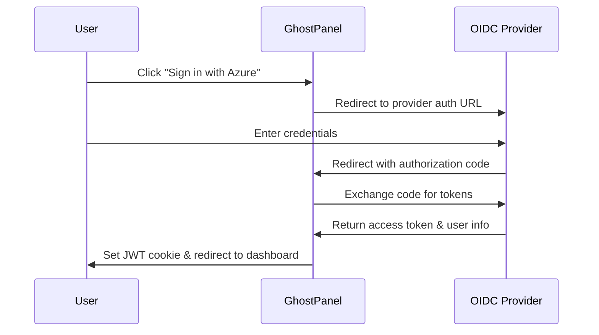
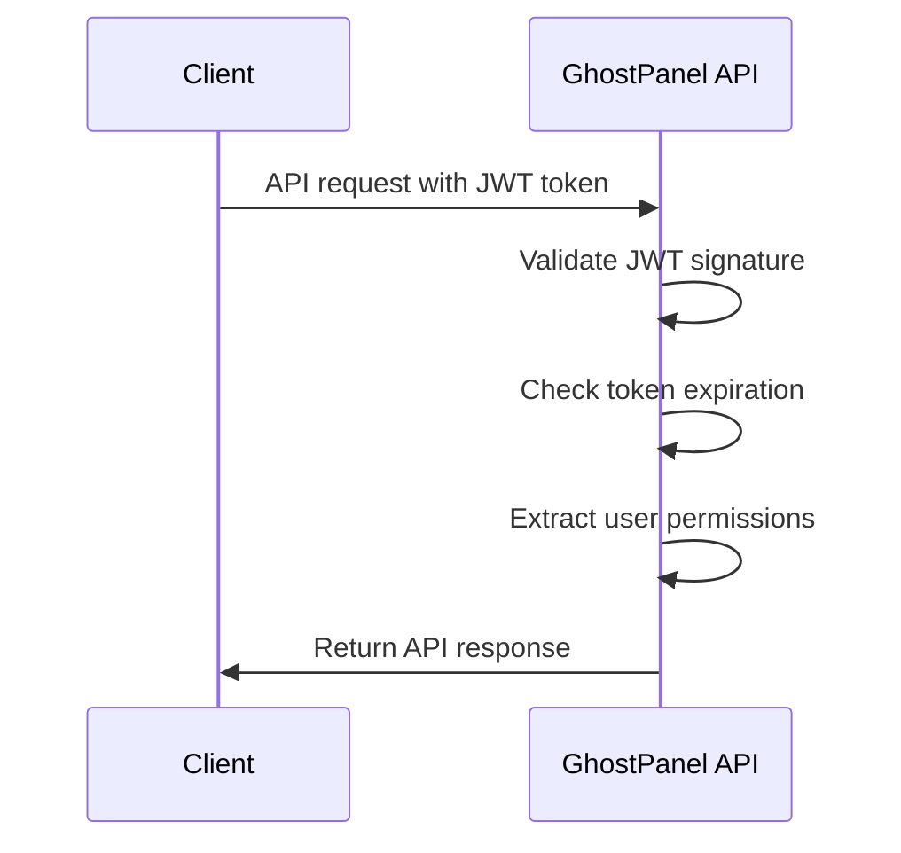

# GhostPanel Single Sign-On (SSO) Setup

> **Configure OIDC/OAuth2 authentication with Azure AD, Google, and GitHub**
> Enable enterprise-grade authentication for your Bolt container management platform

---

## 🎯 Overview

GhostPanel supports enterprise Single Sign-On (SSO) through OIDC/OAuth2 providers:

- **Azure Active Directory** - Enterprise Microsoft accounts
- **Google Workspace** - Google business and personal accounts
- **GitHub** - Developer-focused authentication
- **Custom OIDC** - Any OpenID Connect compatible provider

## 🔧 Configuration

### Environment Variables

Set these environment variables in your GhostPanel deployment:

```bash
# Authentication settings
GPANEL_AUTH_ENABLED=true
GPANEL_JWT_SECRET=your-super-secure-jwt-secret-key-here
GPANEL_SESSION_TIMEOUT=24h

# OIDC/OAuth2 settings
GPANEL_OIDC_ENABLED=true
GPANEL_REDIRECT_URL=https://your-ghostpanel.domain.com/auth/callback

# Enable specific providers (set to true to enable)
GPANEL_AZURE_ENABLED=false
GPANEL_GOOGLE_ENABLED=false
GPANEL_GITHUB_ENABLED=false
```

### Provider-Specific Configuration

Each provider requires its own configuration section:

```toml
# Boltfile.toml authentication section
[services.gpanel-web.auth]
enabled = true
jwt_secret = "${GPANEL_JWT_SECRET}"
session_timeout = "24h"

[services.gpanel-web.auth.oidc]
enabled = true
redirect_url = "https://ghostpanel.yourdomain.com/auth/callback"

# Configure your chosen providers (see individual guides below)
```

---

## 📋 Quick Setup Links

- [📘 Azure Active Directory Setup](./AZURE.md)
- [🟥 Google OAuth2 Setup](./GOOGLE.md)
- [⚫ GitHub OAuth Setup](./GITHUB.md)

---

## 🔐 Security Best Practices

### JWT Configuration
```bash
# Generate a secure JWT secret (32+ characters)
openssl rand -base64 32

# Use environment variables, never hardcode secrets
GPANEL_JWT_SECRET=your-generated-secret
```

### HTTPS Requirements
- **Production**: HTTPS is mandatory for OAuth2/OIDC
- **Development**: HTTP localhost is allowed for testing
- **Redirects**: All redirect URIs must match exactly

### Session Management
```bash
# Configure session timeout
GPANEL_SESSION_TIMEOUT=8h      # 8 hours
GPANEL_SESSION_TIMEOUT=30d     # 30 days
GPANEL_SESSION_TIMEOUT=0       # No expiration (not recommended)
```

---

## 🚀 Deployment Examples

### Docker Compose

```yaml
version: '3.8'
services:
  gpanel-web:
    image: ghostpanel/web:latest
    ports:
      - "9443:9443"
    environment:
      - GPANEL_AUTH_ENABLED=true
      - GPANEL_JWT_SECRET=${GPANEL_JWT_SECRET}
      - GPANEL_OIDC_ENABLED=true
      - GPANEL_REDIRECT_URL=https://ghostpanel.yourcompany.com/auth/callback
      - GPANEL_AZURE_ENABLED=true
      - GPANEL_AZURE_CLIENT_ID=${AZURE_CLIENT_ID}
      - GPANEL_AZURE_CLIENT_SECRET=${AZURE_CLIENT_SECRET}
      - GPANEL_AZURE_TENANT_ID=${AZURE_TENANT_ID}
```

### Kubernetes

```yaml
apiVersion: v1
kind: Secret
metadata:
  name: ghostpanel-auth
data:
  jwt-secret: <base64-encoded-jwt-secret>
  azure-client-secret: <base64-encoded-azure-secret>
---
apiVersion: apps/v1
kind: Deployment
metadata:
  name: ghostpanel-web
spec:
  template:
    spec:
      containers:
      - name: ghostpanel-web
        image: ghostpanel/web:latest
        env:
        - name: GPANEL_AUTH_ENABLED
          value: "true"
        - name: GPANEL_JWT_SECRET
          valueFrom:
            secretKeyRef:
              name: ghostpanel-auth
              key: jwt-secret
        - name: GPANEL_AZURE_CLIENT_SECRET
          valueFrom:
            secretKeyRef:
              name: ghostpanel-auth
              key: azure-client-secret
```

### Bolt Deployment

```toml
# Boltfile.toml
[services.gpanel-web.auth]
enabled = true
jwt_secret = "${GPANEL_JWT_SECRET}"

[services.gpanel-web.auth.oidc.azure]
enabled = true
client_id = "${AZURE_CLIENT_ID}"
client_secret = "${AZURE_CLIENT_SECRET}"
tenant_id = "${AZURE_TENANT_ID}"
```

---

## 🔄 Authentication Flow

### 1. User Login Flow


### 2. API Authentication


---

## 🛠️ Testing Authentication

### Local Testing
```bash
# Start GhostPanel with OAuth enabled
docker run -p 9443:9443 \
  -e GPANEL_AUTH_ENABLED=true \
  -e GPANEL_JWT_SECRET=test-secret \
  -e GPANEL_OIDC_ENABLED=true \
  -e GPANEL_REDIRECT_URL=http://localhost:9443/auth/callback \
  -e GPANEL_AZURE_ENABLED=true \
  -e GPANEL_AZURE_CLIENT_ID=your-test-client-id \
  -e GPANEL_AZURE_CLIENT_SECRET=your-test-secret \
  -e GPANEL_AZURE_TENANT_ID=your-tenant-id \
  ghostpanel/web:latest

# Test authentication flow
curl -I http://localhost:9443/api/containers
# Should return 401 Unauthorized

# After successful login, test with JWT
curl -H "Authorization: Bearer your-jwt-token" \
     http://localhost:9443/api/containers
# Should return container data
```

### Health Check Endpoints
```bash
# Check auth system status
curl http://localhost:9443/api/auth/health

# Check configured providers
curl http://localhost:9443/api/auth/providers

# Validate JWT token
curl -X POST http://localhost:9443/api/auth/validate \
  -H "Authorization: Bearer your-jwt-token"
```

---

## 🔍 Troubleshooting

### Common Issues

**❌ "Invalid redirect URI"**
```bash
# Ensure redirect URI matches exactly
GPANEL_REDIRECT_URL=https://ghostpanel.domain.com/auth/callback
# Provider redirect URI: https://ghostpanel.domain.com/auth/callback
```

**❌ "HTTPS required"**
```bash
# Use HTTPS in production
GPANEL_REDIRECT_URL=https://ghostpanel.domain.com/auth/callback
# NOT http://ghostpanel.domain.com/auth/callback
```

**❌ "Invalid client secret"**
```bash
# Check environment variables are set
env | grep GPANEL_
# Verify secrets in provider console
```

### Debug Logging
```bash
# Enable debug logging
RUST_LOG=debug
GPANEL_LOG_LEVEL=debug

# Check authentication logs
docker logs ghostpanel-web | grep auth
```

### Provider-Specific Issues

**Azure AD:**
- Verify tenant ID is correct
- Check app registration redirect URIs
- Ensure required API permissions are granted

**Google:**
- Enable Google+ API in Google Cloud Console
- Verify OAuth consent screen configuration
- Check domain verification if using custom domain

**GitHub:**
- Confirm OAuth app callback URL
- Check organization access if using GitHub organizations
- Verify email permissions are requested

---

## 📊 Monitoring & Analytics

### Authentication Metrics
```bash
# Login success rate
curl http://localhost:9443/api/metrics | grep auth_login_success_total

# Failed authentication attempts
curl http://localhost:9443/api/metrics | grep auth_login_failed_total

# Active sessions
curl http://localhost:9443/api/metrics | grep auth_sessions_active
```

### User Activity
- Track login/logout events
- Monitor session duration
- Detect suspicious authentication patterns
- Export authentication logs to SIEM systems

---

**🔒 GhostPanel SSO provides enterprise-grade security for your Bolt container infrastructure** - ensuring only authorized users can access and manage your gaming and development containers. Follow the provider-specific guides for detailed setup instructions!

🚀 **Next Steps:** Choose your authentication provider and follow the detailed setup guide!